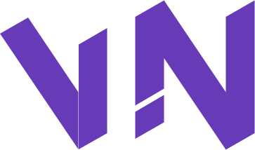

<!-- PROJECT LOGO -->
<br />
<div align="center">
  <a href="https://github.com/gitViwe/open-hubviwe">
    
  </a>

<h3 align="center">The Base Project</h3>

  <p align="center">
    Welcome to my Playground!
    <br />
    <a href="#usage"><strong>Explore the docs »</strong></a>
    <br />
    <br />
    <a href="https://victorious-sand-022f5b51e.4.azurestaticapps.net" target="_blank">View Demo</a>
    ·
    <a href="https://github.com/gitViwe/open-hubviwe/issues">Report Bug</a>
    ·
    <a href="https://github.com/gitViwe/open-hubviwe/issues">Request Feature</a>
  </p>
</div>


<!-- TABLE OF CONTENTS -->
<details>
  <summary>Table of Contents</summary>
  <ol>
    <li>
      <a href="#about-the-project">About The Project</a>
      <ul>
        <li><a href="#built-with">Built With</a></li>
      </ul>
    </li>
    <li>
      <a href="#getting-started">Getting Started</a>
      <ul>
        <li><a href="#prerequisites">Prerequisites</a></li>
        <li><a href="#installation">Installation</a></li>
      </ul>
    </li>
    <li><a href="#usage">Usage</a></li>
    <li><a href="#roadmap">Roadmap</a></li>
    <li><a href="#license">License</a></li>
    <li><a href="#contact">Contact</a></li>
    <li><a href="#acknowledgments">Acknowledgments</a></li>
  </ol>
</details>


<!-- ABOUT THE PROJECT -->
## About The Project

![Product Name Screen Shot][services-diagram-screenshot]

An overview of my playground, the landscape will most definitely change so please check back in from time to time...

<p align="right">(<a href="#top">back to top</a>)</p>


### Built With

* [.NET 8](https://dotnet.microsoft.com/en-us/download/dotnet/8.0)
* [Blazor](https://dotnet.microsoft.com/en-us/apps/aspnet/web-apps/blazor)
* [SignalR](https://dotnet.microsoft.com/en-us/apps/aspnet/signalr)
* [OpenTelemetry](https://opentelemetry.io)

<p align="right">(<a href="#top">back to top</a>)</p>


<!-- GETTING STARTED -->
## Getting Started

Here's how you may go about with setting up your project locally.
To get a local copy up and running follow these simple example steps.

### Prerequisites

Things you need to use the software and how to install them.
* [Visual Studio / Visual Studio Code](https://visualstudio.microsoft.com/)
* [.NET 8](https://dotnet.microsoft.com/en-us/download/dotnet/8.0)
* [Docker](https://www.docker.com/)
* [Node.js v18.16.0 (optional)](https://nodejs.org/en/download)

### Installation

1. Clone the repo
   ```sh
   git clone https://github.com/gitViwe/open-hubviwe.git
   ```
2. Navigate to the root folder `the-base`

3. Run via Docker
   ```
   docker compose up -d
   ```

### Troubleshoot

Docker compose
* If you run into this error while building images: `net/http: TLS handshake timeout`,
   try to pull the `mssql/server` image seperately by running the command: `docker pull mcr.microsoft.com/mssql/server:2019-CU18-ubuntu-20.04`

<p align="right">(<a href="#top">back to top</a>)</p>


<!-- USAGE EXAMPLES -->
## Usage

Let's pop open the toy box and discover the playground.

Go to the [Blazor playground](http://localhost:5062/) to get started.

_For more examples, please refer to the documentation_
* [Authentication API](/documentation/authentication-api.md)
* [Feature API](/documentation/feature-api.md)
* [Realtime API](/documentation/realtime-api.md)

<p align="right">(<a href="#top">back to top</a>)</p>


<!-- ROADMAP -->
## Roadmap

- API Gateway:
    - [x] Add YARP
    - [x] Health Checks
    - [x] OpenTelemetry
    - [x] Docker support
    - [x] Azure App Configuration
    - [ ] Rate limiting
    - [ ] Versioning
    - [ ] Cache support
    - [ ] Compression support
- Authentication API:
    - [x] Open API
    - [x] Health Check
    - [x] OpenTelemetry
    - [x] Docker support
    - [x] JSON Web Token
    - [x] QR code authenticator
    - [x] Azure App Configuration
    - [ ] Permissions management
    - [ ] SendGrid
    - [ ] FIDO2
- Feature API:
    - [x] Open API
    - [x] Health Check
    - [x] OpenTelemetry
    - [x] Docker support
    - [x] Azure App Configuration
    - [ ] Database Schema (Game)
    - [ ] Realtime integration (Game)
    - [ ] Database Schema (Blog)
- Realtime API:
    - [ ] GraphQL
    - [x] SignalR
    - [x] Health Check
    - [x] Azure App Configuration
- Blazor Web Assembly:
    - [x] MudBlazor UI
    - [x] Mobile Client
    - [ ] Desktop Administrator Client
    - [x] OpenTelemetry
    - [x] Docker support
    - [x] Local Storage
    - [ ] Cache Storage
    - [x] Authorization & Authentication
    - [ ] SignalR Page UI
    - [ ] GraphQL Page UI
    - [ ] UI Components (Game)
    - [ ] UI Components (Blog)
    - [ ] FIDO2
    - [x] User Account Management
    - [ ] Role Management
    - [ ] Role Permission Management
    - [ ] User Role Management
    - [ ] User Permission Management
    - [x] SignalR Integration
    - [x] File Upload
- Observability:
    - [x] OpenTelemetry collector
    - [x] Seq logging (Docker)
    - [x] Jaeger traces (Docker)
    - [ ] Grafana metrics (Docker)
    - [x] Honeycomb (Production)
- Pipeline:
    - [x] GitHub action (general)
    - [x] GitHub action (Gateway)
    - [x] GitHub action (Authentication)
    - [x] GitHub action (Feature)
    - [ ] GitHub action (Realtime)
- Azure:
    - [x] API Gateway
    - [x] Authentication API
    - [x] Feature API
    - [x] Notification API
    - [x] SignalR Server
    - [x] Blazor Web Assembly

See the [open issues](https://github.com/gitViwe/open-hubviwe.git/issues) for a full list of proposed features (and known issues).

<p align="right">(<a href="#top">back to top</a>)</p>


<!-- LICENSE -->
## License

Distributed under the MIT License. See `LICENSE.txt` for more information.

<p align="right">(<a href="#top">back to top</a>)</p>


<!-- CONTACT -->
## Contact

Please reach out to me - viwe.nkepu@hotmail.com

Project Link: [Blazor Playground](https://victorious-sand-022f5b51e.4.azurestaticapps.net/)

<p align="right">(<a href="#top">back to top</a>)</p>


<!-- ACKNOWLEDGMENTS -->
## Acknowledgments

* [Tim Corey](https://www.iamtimcorey.com)
* [Mukesh Murugan](https://github.com/iammukeshm)
* [Nick Chapsas](https://www.youtube.com/@nickchapsas)
* [MudBlazor](https://mudblazor.com/)

<p align="right">(<a href="#top">back to top</a>)</p>


<!-- MARKDOWN LINKS & IMAGES -->
<!-- https://www.markdownguide.org/basic-syntax/#reference-style-links -->
[contributors-shield]: https://img.shields.io/github/contributors/gitViwe/CleanArchitecture.svg?style=for-the-badge
[contributors-url]: https://github.com/gitViwe/CleanArchitecture/graphs/contributors
[forks-shield]: https://img.shields.io/github/forks/gitViwe/CleanArchitecture.svg?style=for-the-badge
[forks-url]: https://github.com/gitViwe/CleanArchitecture/network/members
[stars-shield]: https://img.shields.io/github/stars/gitViwe/CleanArchitecture.svg?style=for-the-badge
[stars-url]: https://github.com/gitViwe/CleanArchitecture/stargazers
[issues-shield]: https://img.shields.io/github/issues/gitViwe/CleanArchitecture.svg?style=for-the-badge
[issues-url]: https://github.com/gitViwe/CleanArchitecture/issues
[license-shield]: https://img.shields.io/github/license/gitViwe/CleanArchitecture.svg?style=for-the-badge
[license-url]: https://github.com/gitViwe/CleanArchitecture/blob/master/LICENSE.txt
[linkedin-shield]: https://img.shields.io/badge/-LinkedIn-black.svg?style=for-the-badge&logo=linkedin&colorB=555
[linkedin-url]: https://linkedin.com/in/linkedin_username
[product-screenshot]: images/services-diagram.svg
[services-diagram-screenshot]: images/services-diagram.svg
[auth-api-diagram-screenshot]: images/auth-api-diagram.svg
[feature-api-diagram-screenshot]: images/feature-api-diagram.svg
